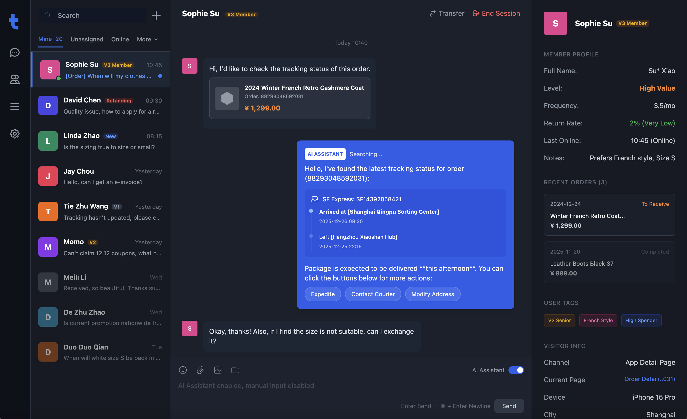

<p align="center">
  
</p>

<p align="center">
  <a href="./README.md">English</a> | <a href="./README_CN.md">简体中文</a> | <a href="./README_TC.md">繁體中文</a> | <a href="./README_JP.md">日本語</a> | <a href="./README_RU.md">Русский</a>
</p>

<p align="center">
  <a href="https://tgo.ai">Website</a> | <a href="https://tgo.ai">Documentation</a>
</p>

## TGO Introduction

TGO is an open-source AI agent customer service platform dedicated to helping enterprises "Build AI Agent Teams for Customer Service". It integrates multi-channel access, agent orchestration, knowledge base management (RAG), and human agent collaboration.



## 🚀 Quick Start

### One-Click Deployment

Run the following command on your server to check requirements, clone the repository, and start the services:

```bash
REF=latest curl -fsSL https://raw.githubusercontent.com/tgoai/tgo/main/bootstrap.sh | bash
```

> **For users in China** (using Gitee and Aliyun mirrors):
> ```bash
> REF=latest curl -fsSL https://gitee.com/tgoai/tgo/raw/main/bootstrap_cn.sh | bash
> ```

### Local Development

Start the full development environment with Docker Compose:

```bash
cp .env.dev.example .env.dev
make dev
```

Useful variants:

```bash
make dev PROFILES=monitoring
make dev DISABLE=tgo-rag-beat,tgo-workflow-worker
```

---

For more details, please visit the [Documentation](https://tgo.ai).

## ✨ Features

### 🤖 AI Agent Orchestration
- **Multi-Agent Support** - Configure multiple AI agents for different business scenarios
- **Multi-Model Integration** - Connect with various LLM providers (OpenAI, Anthropic, etc.)
- **Streaming Response** - Real-time AI responses via SSE for smooth conversation experience
- **Context Memory** - Maintain conversation history for coherent dialogue

### 📚 Knowledge Base (RAG)
- **Document Knowledge Base** - Upload documents to enhance AI response accuracy
- **Q&A Knowledge Base** - Create question-answer pairs for quick knowledge expansion
- **Website Knowledge Base** - Crawl website content to keep information up-to-date
- **Smart Retrieval** - Vector-based semantic search for precise answers

### 🔧 MCP Tools Integration
- **Tool Store** - Rich library of MCP tools, enable on demand
- **Custom Tools** - Project-level tool configuration and management
- **OpenAPI Schema** - Auto-parse schemas to generate interactive forms

### 🌐 Multi-Channel Access
- **Web Widget** - Embeddable chat widget for websites
- **WeChat Integration** - Official Account and Mini Program support
- **Unified Management** - Manage all channels from a single dashboard

### 💬 Real-time Communication
- **WuKongIM Integration** - Stable and reliable instant messaging
- **WebSocket Connection** - Efficient bidirectional communication
- **Message Sync** - Read/unread status, delivery confirmation
- **Rich Media** - Support for text, images, files and more

### 👥 Human-AI Collaboration
- **Smart Handoff** - Seamlessly transfer to human agents when needed
- **Visitor Management** - Collect visitor info, assign sessions, track history
- **Agent Workspace** - Unified interface for human agents

### 🎨 UI Widget System
- **Structured Display** - Render orders, products, logistics as beautiful cards
- **Rich Components** - Order cards, logistics tracking, product display, price comparison
- **Action Protocol** - Standardized URI protocol for interactions

## 📦 Repository Structure

| Repository | Description | Tech Stack |
|:---|:---|:---|
| [tgo-ai](repos/tgo-ai) | AI/ML operations service for managing agents, tool bindings, knowledge bases, and usage analytics | Python / FastAPI |
| [tgo-api](repos/tgo-api) | Core business logic service handling user management, visitor tracking, assignment, and communication | Python / FastAPI |
| [tgo-cli](repos/tgo-cli) | CLI tool & MCP Server enabling AI agents to execute customer service operations with 40+ built-in tools | TypeScript / Node.js |
| [tgo-device-agent](repos/tgo-device-agent) | Embedded agent running on managed devices providing file and shell capabilities via TCP JSON-RPC | Go |
| [tgo-device-control](repos/tgo-device-control) | Device control service managing TCP/JSON-RPC connections for remote device management with MCP Agent | Python / FastAPI |
| [tgo-platform](repos/tgo-platform) | Multi-channel message intake service supporting WeChat, Feishu, DingTalk, Telegram, Slack, email, etc. | Python / FastAPI |
| [tgo-plugin-runtime](repos/tgo-plugin-runtime) | Plugin lifecycle management and execution service with dynamic tool synchronization | Python / FastAPI |
| [tgo-rag](repos/tgo-rag) | RAG service providing document processing, hybrid semantic/full-text search, and async processing | Python / FastAPI |
| [tgo-web](repos/tgo-web) | Admin frontend with real-time chat, AI agent management, knowledge base, and MCP tool integration | TypeScript / React 19 |
| [tgo-workflow](repos/tgo-workflow) | AI Agent workflow execution engine supporting DAG topology with LLM, API, condition, and tool nodes | Python / FastAPI |

### Widget SDKs

| Repository | Description | Tech Stack |
|:---|:---|:---|
| [tgo-widget-js](repos/tgo-widget-js) | Embeddable customer service chat widget (Intercom-style) for websites | TypeScript / React 18 |
| [tgo-widget-ios](repos/tgo-widget-ios) | Native iOS customer service chat SDK with SwiftUI views and UIKit bridging | Swift / SwiftUI |
| [tgo-widget-flutter](repos/tgo-widget-flutter) | Cross-platform customer service chat widget for iOS and Android | Dart / Flutter |
| [tgo-widget-cli](repos/tgo-widget-cli) | Visitor-facing CLI tool & MCP Server providing customer service interface | TypeScript / Node.js |
| [tgo-widget-miniprogram](repos/tgo-widget-miniprogram) | WeChat Mini Program chat widget component with AI streaming responses and Markdown rendering | TypeScript |

## 🏗️ System Architecture

<p align="center">
  
</p>

## Product Preview

| | |
|:---:|:---:|
| **Dashboard** <br>  | **Agent Orchestration** <br>  |
| **Knowledge Base** <br>  | **Q&A Debugging** <br>  |
| **MCP Tools** <br>  | **Platform Admin** <br>  |

## System Requirements
- **CPU**: >= 4 Core
- **RAM**: >= 8 GiB
- **OS**: macOS / Linux / WSL2
