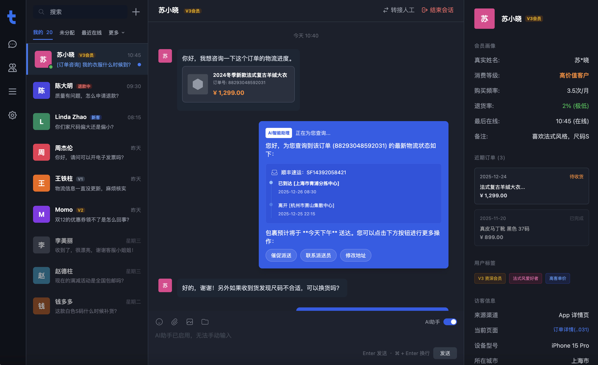
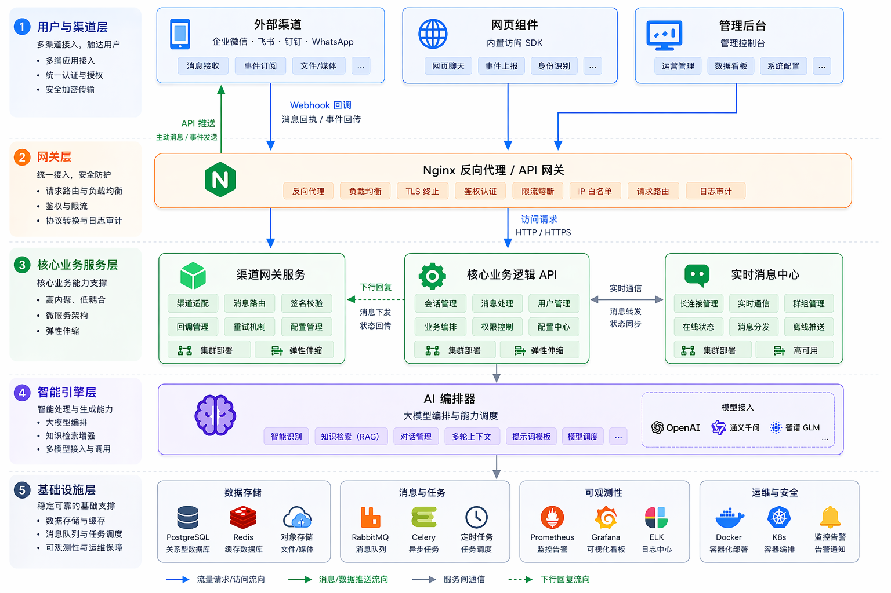

<p align="center">
  
</p>

<p align="center">
  <a href="./README.md">English</a> | <a href="./README_CN.md">简体中文</a> | <a href="./README_TC.md">繁體中文</a> | <a href="./README_JP.md">日本語</a> | <a href="./README_RU.md">Русский</a>
</p>

<p align="center">
  <a href="https://tgo.ai">官网</a> | <a href="https://tgo.ai">文档</a>
</p>

## TGO 介绍

TGO 是一个开源的 AI 智能体客服平台，致力于帮助企业"组建智能体团队为客户服务"。它集成了多渠道接入、智能体编排、知识库管理（RAG）、人工坐席协作等核心功能。



## 🚀 快速开始 (Quick Start)

### 一键部署

在服务器上运行以下命令即可完成检查、克隆并启动服务：

```bash
REF=latest curl -fsSL https://raw.githubusercontent.com/tgoai/tgo/main/bootstrap.sh | bash
```

> **中国境内用户推荐使用国内加速版**（使用 Gitee 和阿里云镜像）：
> ```bash
> REF=latest curl -fsSL https://gitee.com/tgoai/tgo/raw/main/bootstrap_cn.sh | bash
> ```

### 本地开发

使用 Docker Compose 一键启动完整开发环境：

```bash
cp .env.dev.example .env.dev
make dev
```

常用变体：

```bash
make dev PROFILES=monitoring
make dev DISABLE=tgo-rag-beat,tgo-workflow-worker
```

---

更多详细信息请参阅 [文档](https://tgo.ai)。

## ✨ 核心特性

### 🤖 AI 智能体编排
- **多智能体支持** - 支持配置多个 AI 智能体，可根据业务场景选择不同的 Agent
- **多模型集成** - 支持接入多种大模型提供商（OpenAI、Anthropic 等）
- **流式响应** - 基于 SSE 的实时流式消息传输，即时展示 AI 回复
- **上下文记忆** - 支持历史对话记录，AI 可基于上下文提供连贯的对话体验

### 📚 知识库管理 (RAG)
- **文档知识库** - 支持上传文档构建知识库，增强 AI 回答准确性
- **QA 知识库** - 问答对形式的知识管理，快速扩展 AI 知识
- **网站知识库** - 抓取网站内容构建知识，保持信息同步更新
- **智能检索** - 基于向量的语义搜索，精准匹配答案

### 🔧 MCP 工具集成
- **工具商店** - 丰富的 MCP 工具库，按需启用
- **自定义工具** - 支持项目级别的工具配置和管理
- **OpenAPI Schema** - 自动解析 Schema 生成交互表单

### 🌐 多渠道接入
- **Web 组件** - 可嵌入网站的聊天组件
- **微信集成** - 支持公众号、小程序接入
- **统一管理** - 在同一后台管理所有接入渠道

### 💬 实时通讯
- **悟空 IM 集成** - 深度集成悟空 IM，提供稳定可靠的即时通讯能力
- **WebSocket 长连接** - 高效的双向通信，支持消息即时推送
- **消息状态同步** - 已读/未读状态、消息送达确认
- **多媒体支持** - 支持文本、图片、文件等多种消息类型

### 👥 人机协作
- **智能转接** - 必要时无缝转接人工客服
- **访客管理** - 访客信息收集、会话分配、历史记录
- **坐席工作台** - 统一的人工客服操作界面

### 🎨 UI Widget 系统
- **结构化展示** - AI 返回的订单、商品、物流等信息以精美卡片形式呈现
- **丰富组件** - 订单卡片、物流追踪、商品展示、价格对比等
- **交互协议** - 标准化的 Action URI 协议，支持链接跳转、消息发送、内容复制

## 📦 仓库结构

| 仓库 | 说明 | 技术栈 |
|:---|:---|:---|
| [tgo-ai](repos/tgo-ai) | AI/ML 运营服务，管理智能体、工具绑定、知识库和用量统计 | Python / FastAPI |
| [tgo-api](repos/tgo-api) | 核心业务逻辑服务，处理用户管理、访客追踪、会话分配和通信 | Python / FastAPI |
| [tgo-cli](repos/tgo-cli) | CLI 工具 & MCP Server，使 AI 智能体可执行客服操作，内置 40+ 工具 | TypeScript / Node.js |
| [tgo-device-agent](repos/tgo-device-agent) | 运行在受管设备上的嵌入式代理，通过 TCP JSON-RPC 提供文件和 Shell 能力 | Go |
| [tgo-device-control](repos/tgo-device-control) | 设备控制服务，通过 TCP/JSON-RPC 管理远程设备连接，内置 MCP Agent | Python / FastAPI |
| [tgo-platform](repos/tgo-platform) | 多渠道消息接入服务，支持微信、飞书、钉钉、Telegram、Slack、邮件等 | Python / FastAPI |
| [tgo-plugin-runtime](repos/tgo-plugin-runtime) | 插件生命周期管理和执行服务，支持动态工具同步 | Python / FastAPI |
| [tgo-rag](repos/tgo-rag) | RAG 服务，提供文档处理、混合语义/全文检索和异步处理 | Python / FastAPI |
| [tgo-web](repos/tgo-web) | 管理前端，集成实时聊天、智能体管理、知识库和 MCP 工具 | TypeScript / React 19 |
| [tgo-workflow](repos/tgo-workflow) | AI Agent 工作流执行引擎，支持 DAG 拓扑，含 LLM、API、条件和工具节点 | Python / FastAPI |

### Widget SDK

| 仓库 | 说明 | 技术栈 |
|:---|:---|:---|
| [tgo-widget-js](repos/tgo-widget-js) | 可嵌入网站的客服聊天组件（Intercom 风格） | TypeScript / React 18 |
| [tgo-widget-ios](repos/tgo-widget-ios) | 原生 iOS 客服聊天 SDK，SwiftUI 视图 + UIKit 桥接 | Swift / SwiftUI |
| [tgo-widget-flutter](repos/tgo-widget-flutter) | 跨平台客服聊天组件，支持 iOS 和 Android | Dart / Flutter |
| [tgo-widget-cli](repos/tgo-widget-cli) | 面向访客的 CLI 工具 & MCP Server，提供客服交互界面 | TypeScript / Node.js |
| [tgo-widget-miniprogram](repos/tgo-widget-miniprogram) | 微信小程序聊天组件，支持 AI 流式响应和 Markdown 渲染 | TypeScript |

## 🏗️ 系统架构

<p align="center">
  
</p>

## 产品预览

| | |
|:---:|:---:|
| **首页** <br>  | **智能体编排** <br>  |
| **知识库管理** <br>  | **问答调试** <br>  |
| **MCP 工具** <br>  | **平台管理** <br>  |

## 机器配置要求
- **CPU**: >= 4 Core
- **RAM**: >= 8 GiB
- **OS**: macOS / Linux / WSL2
