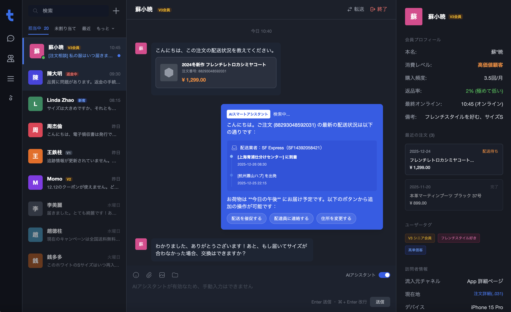
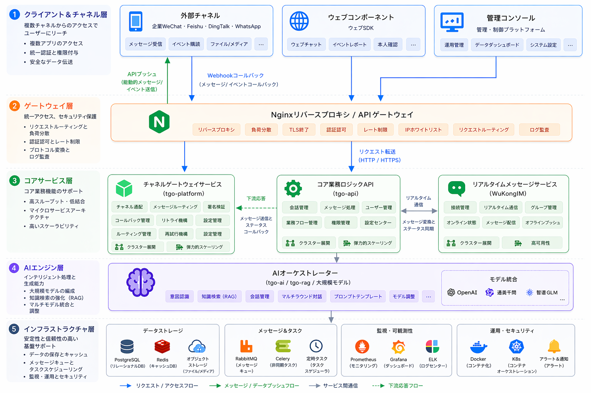

<p align="center">
  
</p>

<p align="center">
  <a href="./README.md">English</a> | <a href="./README_CN.md">简体中文</a> | <a href="./README_TC.md">繁體中文</a> | <a href="./README_JP.md">日本語</a> | <a href="./README_RU.md">Русский</a>
</p>

<p align="center">
  <a href="https://tgo.ai">公式サイト</a> | <a href="https://tgo.ai">ドキュメント</a>
</p>

## TGO 紹介

TGOは、企業が「顧客サービスのためのAIエージェントチームを構築する」ことを支援する、オープンソースのAIエージェントカスタマーサービスプラットフォームです。マルチチャネルアクセス、エージェントオーケストレーション、ナレッジベース管理（RAG）、人間のエージェントとの連携などの主要機能を統合しています。



## 🚀 クイックスタート (Quick Start)

### ワンクリックデプロイ

以下のコマンドをサーバーで実行して、要件を確認し、リポジトリをクローンして、サービスを開始します。

```bash
REF=latest curl -fsSL https://raw.githubusercontent.com/tgoai/tgo/main/bootstrap.sh | bash
```

---

詳細については、[ドキュメント](https://tgo.ai)をご覧ください。

## ✨ 主な機能

### 🤖 AIエージェントオーケストレーション
- **マルチエージェント対応** - ビジネスシナリオに応じて複数のAIエージェントを設定可能
- **マルチモデル統合** - 様々なLLMプロバイダー（OpenAI、Anthropicなど）に対応
- **ストリーミング応答** - SSEによるリアルタイム応答でスムーズな会話体験
- **コンテキストメモリ** - 会話履歴を維持し、一貫した対話を実現

### 📚 ナレッジベース管理 (RAG)
- **ドキュメントナレッジベース** - ドキュメントをアップロードしてAI回答の精度を向上
- **Q&Aナレッジベース** - 質問と回答のペアで迅速にナレッジを拡張
- **ウェブサイトナレッジベース** - ウェブサイトをクロールして情報を最新に保つ
- **スマート検索** - ベクトルベースのセマンティック検索で正確な回答を提供

### 🔧 MCPツール統合
- **ツールストア** - 豊富なMCPツールライブラリ、必要に応じて有効化
- **カスタムツール** - プロジェクトレベルのツール設定と管理
- **OpenAPI Schema** - スキーマを自動解析してインタラクティブフォームを生成

### 🌐 マルチチャネルアクセス
- **Webウィジェット** - ウェブサイトに埋め込み可能なチャットウィジェット
- **WeChat統合** - 公式アカウントとミニプログラムに対応
- **統合管理** - 単一のダッシュボードですべてのチャネルを管理

### 💬 リアルタイム通信
- **WuKongIM統合** - 安定した信頼性の高いインスタントメッセージング
- **WebSocket接続** - 効率的な双方向通信
- **メッセージ同期** - 既読/未読ステータス、配信確認
- **リッチメディア** - テキスト、画像、ファイルなどに対応

### 👥 人間とAIの協働
- **スマートハンドオフ** - 必要に応じて人間のエージェントにシームレスに転送
- **訪問者管理** - 訪問者情報の収集、セッション割り当て、履歴追跡
- **エージェントワークスペース** - 人間のエージェント用の統合インターフェース

### 🎨 UIウィジェットシステム
- **構造化表示** - 注文、商品、物流情報を美しいカードで表示
- **豊富なコンポーネント** - 注文カード、物流追跡、商品表示、価格比較など
- **アクションプロトコル** - インタラクション用の標準化されたURIプロトコル

## 📦 リポジトリ構成

| リポジトリ | 説明 | 技術スタック |
|:---|:---|:---|
| [tgo-ai](repos/tgo-ai) | AI/ML運用サービス。エージェント、ツールバインディング、ナレッジベース、利用統計を管理 | Python / FastAPI |
| [tgo-api](repos/tgo-api) | コアビジネスロジックサービス。ユーザー管理、訪問者追跡、セッション割り当て、通信を処理 | Python / FastAPI |
| [tgo-cli](repos/tgo-cli) | CLIツール & MCPサーバー。AIエージェントが40以上の組み込みツールで顧客サービス操作を実行可能 | TypeScript / Node.js |
| [tgo-device-agent](repos/tgo-device-agent) | 管理対象デバイス上で動作する組み込みエージェント。TCP JSON-RPCでファイルとシェル機能を提供 | Go |
| [tgo-device-control](repos/tgo-device-control) | デバイス制御サービス。TCP/JSON-RPCによるリモートデバイス管理、MCP Agent内蔵 | Python / FastAPI |
| [tgo-platform](repos/tgo-platform) | マルチチャネルメッセージ受付サービス。WeChat、Feishu、DingTalk、Telegram、Slack、メール等に対応 | Python / FastAPI |
| [tgo-plugin-runtime](repos/tgo-plugin-runtime) | プラグインのライフサイクル管理と実行サービス。動的ツール同期に対応 | Python / FastAPI |
| [tgo-rag](repos/tgo-rag) | RAGサービス。ドキュメント処理、ハイブリッドセマンティック/全文検索、非同期処理を提供 | Python / FastAPI |
| [tgo-web](repos/tgo-web) | 管理フロントエンド。リアルタイムチャット、エージェント管理、ナレッジベース、MCPツールを統合 | TypeScript / React 19 |
| [tgo-workflow](repos/tgo-workflow) | AI Agentワークフロー実行エンジン。DAGトポロジー対応、LLM・API・条件・ツールノードを含む | Python / FastAPI |

### Widget SDK

| リポジトリ | 説明 | 技術スタック |
|:---|:---|:---|
| [tgo-widget-js](repos/tgo-widget-js) | ウェブサイトに埋め込み可能なカスタマーサービスチャットウィジェット（Intercomスタイル） | TypeScript / React 18 |
| [tgo-widget-ios](repos/tgo-widget-ios) | ネイティブiOSカスタマーサービスチャットSDK、SwiftUIビュー + UIKitブリッジ | Swift / SwiftUI |
| [tgo-widget-flutter](repos/tgo-widget-flutter) | iOS・Android対応クロスプラットフォームカスタマーサービスチャットウィジェット | Dart / Flutter |
| [tgo-widget-cli](repos/tgo-widget-cli) | 訪問者向けCLIツール & MCPサーバー。カスタマーサービスインターフェースを提供 | TypeScript / Node.js |
| [tgo-widget-miniprogram](repos/tgo-widget-miniprogram) | WeChatミニプログラムチャットコンポーネント。AIストリーミング応答とMarkdownレンダリングに対応 | TypeScript |

## 🏗️ システムアーキテクチャ

<p align="center">
  
</p>

## 製品プレビュー

| | |
|:---:|:---:|
| **ダッシュボード** <br>  | **エージェント編成** <br>  |
| **ナレッジベース** <br>  | **Q&Aデバッグ** <br>  |
| **MCPツール** <br>  | **プラットフォーム管理** <br>  |

## システム要件
- **CPU**: >= 4 Core
- **RAM**: >= 8 GiB
- **OS**: macOS / Linux / WSL2
