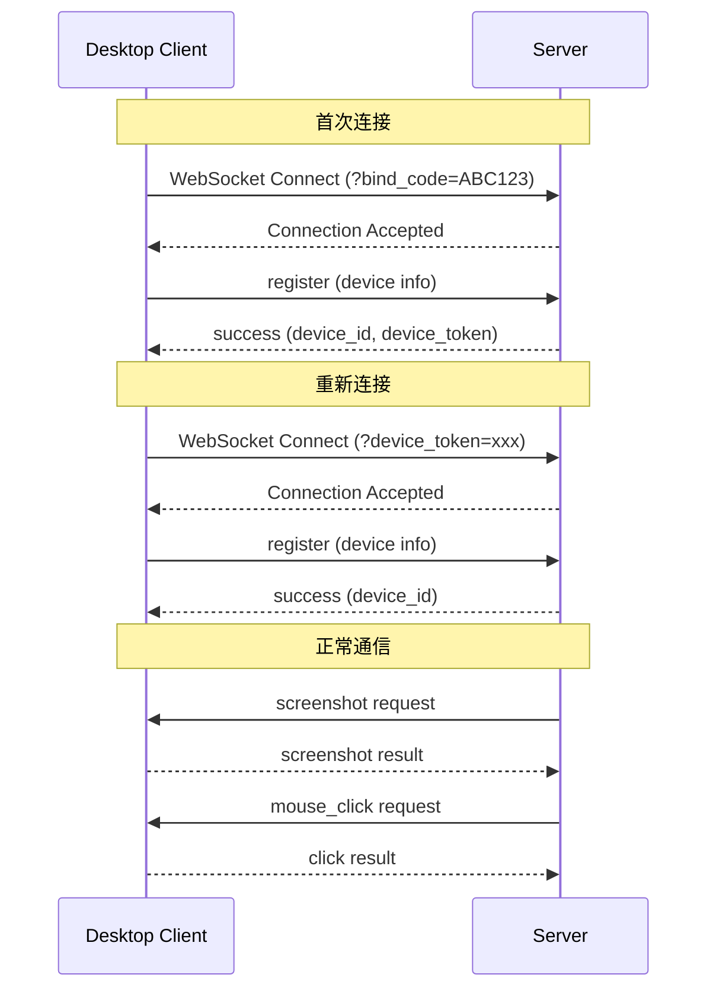

# Desktop Client 协议规范

本文档定义了 TGO Device Control 系统中桌面控制端（Desktop Client）与服务端之间的通信协议。

## 目录

1. [概述](#1-概述)
2. [连接流程](#2-连接流程)
3. [消息格式](#3-消息格式)
4. [认证协议](#4-认证协议)
5. [指令定义](#5-指令定义)
6. [错误处理](#6-错误处理)
7. [心跳机制](#7-心跳机制)
8. [安全考虑](#8-安全考虑)
9. [推荐实现](#9-推荐实现)

---

## 1. 概述

### 1.1 架构

```
┌─────────────────┐         WebSocket          ┌─────────────────────┐
│  Desktop Client │ ◄──────────────────────────► │ tgo-device-control  │
│  (控制端)       │     JSON-RPC 2.0           │ (服务端)            │
└─────────────────┘                             └─────────────────────┘
        │                                                 │
        │ 执行操作                                        │ 下发指令
        ▼                                                 │
   ┌─────────┐                                           │
   │ 用户电脑 │ ◄─────────────────────────────────────────┘
   └─────────┘
```

### 1.2 职责划分

| 组件 | 职责 |
|------|------|
| Desktop Client | 执行操作指令（鼠标、键盘）、截取屏幕、上报结果 |
| tgo-device-control | 管理连接、下发指令、存储截图、暴露 MCP 接口 |

### 1.3 通信协议

- **传输层**: WebSocket (wss:// 或 ws://)
- **消息格式**: JSON-RPC 2.0
- **编码**: UTF-8

---

## 2. 连接流程

### 2.1 连接地址

```
ws://{host}:{port}/ws/device?bind_code={code}
ws://{host}:{port}/ws/device?device_token={token}
```

### 2.2 连接参数

| 参数 | 类型 | 必填 | 说明 |
|------|------|------|------|
| bind_code | string | 首次连接必填 | 6位绑定码，用于设备注册 |
| device_token | string | 重连必填 | 设备令牌，用于已注册设备重连 |

### 2.3 连接流程图



---

## 3. 消息格式

所有消息遵循 JSON-RPC 2.0 规范。

### 3.1 请求消息

```json
{
  "jsonrpc": "2.0",
  "id": 1,
  "method": "method_name",
  "params": {
    "param1": "value1",
    "param2": "value2"
  }
}
```

### 3.2 响应消息（成功）

```json
{
  "jsonrpc": "2.0",
  "id": 1,
  "result": {
    "key": "value"
  }
}
```

### 3.3 响应消息（错误）

```json
{
  "jsonrpc": "2.0",
  "id": 1,
  "error": {
    "code": -32000,
    "message": "Error description",
    "data": {}
  }
}
```

### 3.4 通知消息（无需响应）

```json
{
  "jsonrpc": "2.0",
  "method": "notification_name",
  "params": {}
}
```

---

## 4. 认证协议

### 4.1 设备注册（首次连接）

**请求** (Client → Server):

```json
{
  "jsonrpc": "2.0",
  "id": 1,
  "method": "register",
  "params": {
    "device_name": "MacBook Pro",
    "device_type": "desktop",
    "os": "darwin",
    "os_version": "14.2.1",
    "screen_resolution": "2560x1440",
    "bind_code": "ABC123"
  }
}
```

| 参数 | 类型 | 必填 | 说明 |
|------|------|------|------|
| device_name | string | 是 | 设备名称 |
| device_type | string | 是 | 设备类型：`desktop` / `mobile` |
| os | string | 是 | 操作系统：`darwin` / `windows` / `linux` |
| os_version | string | 否 | 系统版本 |
| screen_resolution | string | 否 | 屏幕分辨率，格式 `宽x高` |
| bind_code | string | 首次连接必填 | 6位绑定码 |

**响应** (Server → Client):

```json
{
  "jsonrpc": "2.0",
  "id": 1,
  "result": {
    "success": true,
    "device_id": "550e8400-e29b-41d4-a716-446655440000",
    "device_token": "eyJhbGciOiJIUzI1NiIs..."
  }
}
```

| 字段 | 类型 | 说明 |
|------|------|------|
| success | boolean | 是否成功 |
| device_id | string | 设备唯一标识（UUID） |
| device_token | string | 设备令牌，用于重连（仅首次注册返回） |

### 4.2 设备重连

使用 `device_token` 作为 URL 参数连接，然后发送 `register` 消息更新设备信息。

---

## 5. 指令定义

所有指令由服务端发送给客户端执行。

### 5.1 截图指令

**请求** (Server → Client):

```json
{
  "jsonrpc": "2.0",
  "id": 1,
  "method": "screenshot",
  "params": {
    "region": null
  }
}
```

| 参数 | 类型 | 必填 | 说明 |
|------|------|------|------|
| region | object | 否 | 截图区域，null 表示全屏 |
| region.x | integer | 是 | 起始 X 坐标 |
| region.y | integer | 是 | 起始 Y 坐标 |
| region.width | integer | 是 | 宽度 |
| region.height | integer | 是 | 高度 |

**响应** (Client → Server):

```json
{
  "jsonrpc": "2.0",
  "id": 1,
  "result": {
    "success": true,
    "width": 2560,
    "height": 1440,
    "format": "png",
    "screenshot_base64": "iVBORw0KGgoAAAANSUhEUgAA..."
  }
}
```

| 字段 | 类型 | 说明 |
|------|------|------|
| success | boolean | 是否成功 |
| width | integer | 图片宽度 |
| height | integer | 图片高度 |
| format | string | 图片格式：`png` / `jpeg` |
| screenshot_base64 | string | Base64 编码的图片数据 |

### 5.2 鼠标点击

**请求**:

```json
{
  "jsonrpc": "2.0",
  "id": 2,
  "method": "mouse_click",
  "params": {
    "x": 100,
    "y": 200,
    "button": "left"
  }
}
```

| 参数 | 类型 | 必填 | 默认值 | 说明 |
|------|------|------|--------|------|
| x | integer | 是 | - | X 坐标 |
| y | integer | 是 | - | Y 坐标 |
| button | string | 否 | `left` | 鼠标按键：`left` / `right` / `middle` |

**响应**:

```json
{
  "jsonrpc": "2.0",
  "id": 2,
  "result": {
    "success": true,
    "x": 100,
    "y": 200,
    "button": "left"
  }
}
```

### 5.3 鼠标双击

**请求**:

```json
{
  "jsonrpc": "2.0",
  "id": 3,
  "method": "mouse_double_click",
  "params": {
    "x": 100,
    "y": 200
  }
}
```

### 5.4 鼠标移动

**请求**:

```json
{
  "jsonrpc": "2.0",
  "id": 4,
  "method": "mouse_move",
  "params": {
    "x": 100,
    "y": 200
  }
}
```

### 5.5 鼠标拖拽

**请求**:

```json
{
  "jsonrpc": "2.0",
  "id": 5,
  "method": "mouse_drag",
  "params": {
    "start_x": 100,
    "start_y": 200,
    "end_x": 300,
    "end_y": 400,
    "button": "left"
  }
}
```

### 5.6 键盘输入

**请求**:

```json
{
  "jsonrpc": "2.0",
  "id": 6,
  "method": "keyboard_type",
  "params": {
    "text": "Hello World"
  }
}
```

| 参数 | 类型 | 必填 | 说明 |
|------|------|------|------|
| text | string | 是 | 要输入的文本 |

**响应**:

```json
{
  "jsonrpc": "2.0",
  "id": 6,
  "result": {
    "success": true,
    "text": "Hello World",
    "characters_typed": 11
  }
}
```

### 5.7 组合键

**请求**:

```json
{
  "jsonrpc": "2.0",
  "id": 7,
  "method": "keyboard_hotkey",
  "params": {
    "keys": ["ctrl", "c"]
  }
}
```

| 参数 | 类型 | 必填 | 说明 |
|------|------|------|------|
| keys | string[] | 是 | 按键列表，支持修饰键 |

**支持的按键**:

- 修饰键: `ctrl`, `alt`, `shift`, `cmd` (macOS), `win` (Windows)
- 功能键: `f1`-`f12`
- 特殊键: `enter`, `tab`, `escape`, `backspace`, `delete`, `space`
- 方向键: `up`, `down`, `left`, `right`
- 其他: `home`, `end`, `pageup`, `pagedown`, `insert`

### 5.8 单键按下

**请求**:

```json
{
  "jsonrpc": "2.0",
  "id": 8,
  "method": "keyboard_press",
  "params": {
    "key": "enter"
  }
}
```

### 5.9 滚动

**请求**:

```json
{
  "jsonrpc": "2.0",
  "id": 9,
  "method": "scroll",
  "params": {
    "x": 500,
    "y": 500,
    "direction": "down",
    "amount": 3
  }
}
```

| 参数 | 类型 | 必填 | 默认值 | 说明 |
|------|------|------|--------|------|
| x | integer | 是 | - | 滚动位置 X 坐标 |
| y | integer | 是 | - | 滚动位置 Y 坐标 |
| direction | string | 是 | - | 方向：`up` / `down` / `left` / `right` |
| amount | integer | 否 | 3 | 滚动量 |

### 5.10 获取屏幕尺寸

**请求**:

```json
{
  "jsonrpc": "2.0",
  "id": 10,
  "method": "get_screen_size",
  "params": {}
}
```

**响应**:

```json
{
  "jsonrpc": "2.0",
  "id": 10,
  "result": {
    "width": 2560,
    "height": 1440
  }
}
```

### 5.11 获取鼠标位置

**请求**:

```json
{
  "jsonrpc": "2.0",
  "id": 11,
  "method": "get_cursor_position",
  "params": {}
}
```

**响应**:

```json
{
  "jsonrpc": "2.0",
  "id": 11,
  "result": {
    "x": 500,
    "y": 300
  }
}
```

---

## 6. 错误处理

### 6.1 错误码定义

| 错误码 | 名称 | 说明 |
|--------|------|------|
| -32700 | Parse Error | JSON 解析错误 |
| -32600 | Invalid Request | 无效的请求 |
| -32601 | Method Not Found | 方法不存在 |
| -32602 | Invalid Params | 参数无效 |
| -32603 | Internal Error | 内部错误 |
| -32001 | Invalid Token | 设备令牌无效 |
| -32002 | Invalid Bind Code | 绑定码无效或已过期 |
| -32003 | Device Not Found | 设备不存在 |
| -32004 | Operation Failed | 操作执行失败 |
| -32005 | Screen Capture Failed | 截图失败 |
| -32006 | Permission Denied | 权限不足 |

### 6.2 错误响应示例

```json
{
  "jsonrpc": "2.0",
  "id": 1,
  "error": {
    "code": -32002,
    "message": "Invalid or expired bind code",
    "data": {
      "bind_code": "ABC123"
    }
  }
}
```

---

## 7. 心跳机制

### 7.1 服务端 Ping

服务端定期发送 ping 消息检测连接状态：

```json
{
  "jsonrpc": "2.0",
  "method": "ping",
  "params": {}
}
```

### 7.2 客户端 Pong

客户端收到 ping 后应立即响应：

```json
{
  "jsonrpc": "2.0",
  "method": "pong",
  "params": {}
}
```

### 7.3 心跳参数

| 参数 | 默认值 | 说明 |
|------|--------|------|
| 心跳间隔 | 30 秒 | 服务端发送 ping 的间隔 |
| 超时时间 | 90 秒 | 无心跳响应判定为断开 |

### 7.4 客户端主动心跳

客户端也可以主动发送心跳：

```json
{
  "jsonrpc": "2.0",
  "id": 100,
  "method": "heartbeat",
  "params": {}
}
```

---

## 8. 安全考虑

### 8.1 传输安全

- **生产环境必须使用 WSS**（WebSocket Secure）
- 建议使用 TLS 1.3

### 8.2 认证安全

- 绑定码有效期为 5 分钟
- 绑定码为一次性使用
- 设备令牌应安全存储在本地

### 8.3 操作安全

- 截图数据可能包含敏感信息，传输时应加密
- 建议实现操作审计日志
- 可实现敏感操作二次确认

### 8.4 客户端安全

- 不要在日志中输出敏感信息
- 设备令牌应使用系统密钥链存储
- 实现自动断开空闲连接

---

## 9. 推荐实现

### 9.1 技术栈推荐

| 平台 | 推荐技术 | 说明 |
|------|----------|------|
| 跨平台 | Python + PyAutoGUI | 简单易用，跨平台支持好 |
| 跨平台 | Electron + robotjs | 适合需要 GUI 的场景 |
| macOS | Swift + AppleScript | 原生性能好 |
| Windows | C# + Windows API | 原生性能好 |
| Linux | Python + Xdotool | 兼容性好 |

### 9.2 Python 实现示例

```python
import asyncio
import json
import pyautogui
import websockets
from PIL import Image
import io
import base64

class DeviceClient:
    def __init__(self, server_url: str):
        self.server_url = server_url
        self.websocket = None
        self.device_token = None
        
    async def connect(self, bind_code: str = None):
        """Connect to the server."""
        url = f"{self.server_url}/ws/device"
        if bind_code:
            url += f"?bind_code={bind_code}"
        elif self.device_token:
            url += f"?device_token={self.device_token}"
            
        self.websocket = await websockets.connect(url)
        
        # Send register message
        await self.send_register()
        
    async def send_register(self):
        """Send device registration."""
        import platform
        
        message = {
            "jsonrpc": "2.0",
            "id": 1,
            "method": "register",
            "params": {
                "device_name": platform.node(),
                "device_type": "desktop",
                "os": platform.system().lower(),
                "os_version": platform.release(),
                "screen_resolution": f"{pyautogui.size().width}x{pyautogui.size().height}"
            }
        }
        
        await self.websocket.send(json.dumps(message))
        response = await self.websocket.recv()
        result = json.loads(response)
        
        if "result" in result and result["result"].get("device_token"):
            self.device_token = result["result"]["device_token"]
            # Save token for reconnection
            self._save_token()
            
    async def run(self):
        """Main message loop."""
        while True:
            try:
                message = await self.websocket.recv()
                data = json.loads(message)
                
                if data.get("method") == "ping":
                    await self._handle_ping()
                elif "method" in data:
                    await self._handle_request(data)
                    
            except websockets.ConnectionClosed:
                await self._reconnect()
                
    async def _handle_request(self, request: dict):
        """Handle incoming request."""
        method = request.get("method")
        params = request.get("params", {})
        request_id = request.get("id")
        
        handlers = {
            "screenshot": self._screenshot,
            "mouse_click": self._mouse_click,
            "mouse_double_click": self._mouse_double_click,
            "keyboard_type": self._keyboard_type,
            "keyboard_hotkey": self._keyboard_hotkey,
            "scroll": self._scroll,
            "get_screen_size": self._get_screen_size,
            "get_cursor_position": self._get_cursor_position,
        }
        
        handler = handlers.get(method)
        if handler:
            try:
                result = await handler(params)
                response = {
                    "jsonrpc": "2.0",
                    "id": request_id,
                    "result": result
                }
            except Exception as e:
                response = {
                    "jsonrpc": "2.0",
                    "id": request_id,
                    "error": {
                        "code": -32004,
                        "message": str(e)
                    }
                }
        else:
            response = {
                "jsonrpc": "2.0",
                "id": request_id,
                "error": {
                    "code": -32601,
                    "message": f"Method not found: {method}"
                }
            }
            
        await self.websocket.send(json.dumps(response))
        
    async def _screenshot(self, params: dict) -> dict:
        """Take a screenshot."""
        region = params.get("region")
        
        if region:
            screenshot = pyautogui.screenshot(
                region=(region["x"], region["y"], 
                       region["width"], region["height"])
            )
        else:
            screenshot = pyautogui.screenshot()
            
        # Convert to base64
        buffer = io.BytesIO()
        screenshot.save(buffer, format="PNG")
        base64_data = base64.b64encode(buffer.getvalue()).decode()
        
        return {
            "success": True,
            "width": screenshot.width,
            "height": screenshot.height,
            "format": "png",
            "screenshot_base64": base64_data
        }
        
    async def _mouse_click(self, params: dict) -> dict:
        """Perform mouse click."""
        x = params["x"]
        y = params["y"]
        button = params.get("button", "left")
        
        pyautogui.click(x, y, button=button)
        
        return {"success": True, "x": x, "y": y, "button": button}
        
    async def _mouse_double_click(self, params: dict) -> dict:
        """Perform double click."""
        x = params["x"]
        y = params["y"]
        
        pyautogui.doubleClick(x, y)
        
        return {"success": True, "x": x, "y": y}
        
    async def _keyboard_type(self, params: dict) -> dict:
        """Type text."""
        text = params["text"]
        
        pyautogui.typewrite(text, interval=0.02)
        
        return {
            "success": True,
            "text": text,
            "characters_typed": len(text)
        }
        
    async def _keyboard_hotkey(self, params: dict) -> dict:
        """Press hotkey combination."""
        keys = params["keys"]
        
        pyautogui.hotkey(*keys)
        
        return {"success": True, "keys": keys}
        
    async def _scroll(self, params: dict) -> dict:
        """Scroll at position."""
        x = params["x"]
        y = params["y"]
        direction = params["direction"]
        amount = params.get("amount", 3)
        
        pyautogui.moveTo(x, y)
        
        if direction in ["up", "down"]:
            clicks = amount if direction == "up" else -amount
            pyautogui.scroll(clicks)
        else:
            clicks = amount if direction == "right" else -amount
            pyautogui.hscroll(clicks)
            
        return {"success": True, "direction": direction, "amount": amount}
        
    async def _get_screen_size(self, params: dict) -> dict:
        """Get screen size."""
        size = pyautogui.size()
        return {"width": size.width, "height": size.height}
        
    async def _get_cursor_position(self, params: dict) -> dict:
        """Get cursor position."""
        pos = pyautogui.position()
        return {"x": pos.x, "y": pos.y}
        
    async def _handle_ping(self):
        """Respond to ping."""
        await self.websocket.send(json.dumps({
            "jsonrpc": "2.0",
            "method": "pong",
            "params": {}
        }))


# Usage
async def main():
    client = DeviceClient("ws://localhost:8085")
    await client.connect(bind_code="ABC123")
    await client.run()

if __name__ == "__main__":
    asyncio.run(main())
```

### 9.3 依赖安装

```bash
# Python 依赖
pip install websockets pyautogui pillow

# macOS 权限设置
# 需要在 系统偏好设置 > 安全性与隐私 > 辅助功能 中授权

# Linux 依赖
# sudo apt-get install python3-tk python3-dev scrot
```

---

## 附录

### A. 完整消息类型列表

| 方向 | 方法 | 说明 |
|------|------|------|
| C→S | register | 设备注册 |
| C→S | heartbeat | 客户端心跳 |
| C→S | pong | 心跳响应 |
| S→C | ping | 服务端心跳 |
| S→C | screenshot | 截图指令 |
| S→C | mouse_click | 鼠标点击 |
| S→C | mouse_double_click | 鼠标双击 |
| S→C | mouse_move | 鼠标移动 |
| S→C | mouse_drag | 鼠标拖拽 |
| S→C | keyboard_type | 键盘输入 |
| S→C | keyboard_hotkey | 组合键 |
| S→C | keyboard_press | 单键按下 |
| S→C | scroll | 滚动 |
| S→C | get_screen_size | 获取屏幕尺寸 |
| S→C | get_cursor_position | 获取鼠标位置 |

### B. 版本历史

| 版本 | 日期 | 说明 |
|------|------|------|
| 1.0.0 | 2026-01-27 | 初始版本 |

---

*文档版本: 1.0.0*
*最后更新: 2026-01-27*
