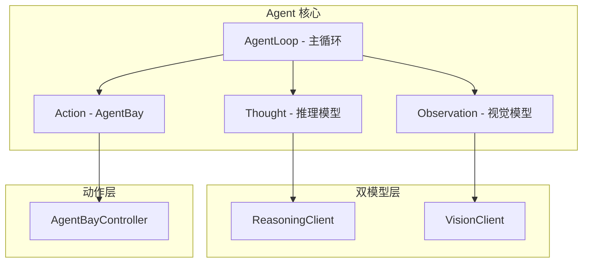

# TGO Vision Agent Service - AI Agents Guide

本文件旨在为 AI 代理（如 Cursor, GitHub Copilot, Claude 等）提供 tgo-vision-agent 服务的架构指南和开发规范。

---

## 1. 服务简介

tgo-vision-agent 是一个基于 **推理模型 + 视觉模型** 双模型架构的 UI 自动化服务，采用 **ReAct (Reasoning + Acting)** 风格的 Agent 模式，通过阿里云无影 AgentBay 的云手机/云桌面能力，实现对无 API 应用的自动化消息收发。

### 核心功能

- **双模型 Agent**: 推理模型负责任务规划，视觉模型负责屏幕分析
- **ReAct 循环**: Observe → Think → Act 迭代执行
- **UI 自动化**: 自动检测应用状态、安装应用、执行操作
- **多应用支持**: 可扩展架构支持微信、抖音、小红书等
- **会话管理**: 管理 AgentBay 云端会话生命周期

---

## 2. 目录结构

```
tgo-vision-agent/
├── app/
│   ├── main.py                    # FastAPI 入口
│   ├── api/v1/                    # API 端点
│   │   ├── sessions.py            # 会话管理 (双模型配置)
│   │   ├── messages.py            # 消息收发
│   │   ├── status.py              # 状态监控
│   │   └── screenshots.py         # 截图调试
│   ├── core/
│   │   ├── config.py              # 配置管理
│   │   ├── agentbay_client.py     # AgentBay 客户端工厂
│   │   └── llm/                   # LLM 客户端层
│   │       ├── __init__.py
│   │       ├── base.py            # 基础 LLM 客户端
│   │       ├── reasoning.py       # 推理模型客户端
│   │       └── vision.py          # 视觉模型客户端
│   ├── domain/
│   │   ├── entities.py            # 领域实体
│   │   ├── ports.py               # 接口定义 (Protocol)
│   │   ├── base/
│   │   │   └── app_automator.py   # 应用自动化基类 (委托给 AgentLoop)
│   │   ├── apps/                  # 应用特定实现
│   │   │   └── wechat/            # 微信自动化
│   │   └── agent/                 # Agent 核心
│   │       ├── __init__.py
│   │       ├── entities.py        # Agent 实体 (Observation, Action, Step)
│   │       ├── agent_loop.py      # ReAct 主循环
│   │       └── prompts/           # 模型提示词
│   │           ├── reasoning.py   # 推理模型提示词
│   │           └── vision.py      # 视觉模型提示词
│   ├── adapters/
│   │   └── agentbay/              # AgentBay SDK 封装
│   ├── workers/
│   │   ├── message_poller.py      # 消息轮询 Worker (使用 AgentLoop)
│   │   ├── session_keeper.py      # 会话保活 Worker
│   │   └── worker_manager.py      # Worker 管理器
│   └── db/
│       ├── base.py                # 数据库连接
│       └── models.py              # 数据模型
├── migrations/                    # Alembic 迁移
└── AGENTS.md                      # 本文件
```

---

## 3. 核心架构

### 3.1 双模型 Agent 架构



### 3.2 AgentLoop 执行流程

```
1. Observe (视觉模型)
   └── 截图 → VisionClient.analyze_screen() → Observation

2. Think (推理模型)
   └── Observation + Goal + History → ReasoningClient.decide_action() → Action

3. Act (AgentBay)
   └── Action → AgentBayController.execute() → Result

4. Loop
   └── 重复直到 Action.type == COMPLETE 或 FAIL
```

### 3.3 简化后的 App Automator

所有应用实现继承 `BaseAppAutomator`，复杂逻辑委托给 `AgentLoop`:

```python
class BaseAppAutomator(ABC):
    app_type: str  # "wechat", "douyin", etc.
    
    def __init__(self, agent: AgentLoop, session_id: str): ...
    
    @abstractmethod
    def get_app_package_name(self) -> str: ...
    
    @abstractmethod
    def get_app_display_name(self) -> str: ...
    
    # 以下方法委托给 AgentLoop
    async def install_app(self) -> AgentResult: ...
    async def ensure_app_running(self) -> AgentResult: ...
    async def send_message(self, contact: str, content: str) -> AgentResult: ...
```

### 3.4 LLM 调用

LLM 通过 tgo-api 内部接口获取 Provider 配置，直接调用各厂商 API:

```
tgo-vision-agent:
├── ReasoningClient → tgo-api (获取配置) → OpenAI/Dashscope/Anthropic API
└── VisionClient    → tgo-api (获取配置) → OpenAI/Dashscope/Anthropic API
```

---

## 4. 开发规范

### 4.1 类型安全

- 严禁使用 `dict` 传递业务数据
- 所有 API 接口必须定义 Pydantic 模型
- 严禁使用 `Any` 类型

### 4.2 添加新应用支持

1. 在 `app/domain/apps/` 下创建新目录 (如 `douyin/`)
2. 实现 `automator.py` 继承 `BaseAppAutomator`
3. 只需实现 `get_app_package_name()` 和 `get_app_display_name()`
4. 在 `AppAutomatorFactory` 注册新实现
5. AgentLoop 会自动处理所有复杂逻辑

### 4.3 Agent 提示词规范

提示词位于 `app/domain/agent/prompts/`:

- **reasoning.py**: 推理模型提示词 (纯文本输入)
  - `ACTION_DECISION_PROMPT`: 动作决策
  - `ERROR_RECOVERY_PROMPT`: 错误恢复

- **vision.py**: 视觉模型提示词 (图像+文本输入)
  - `SCREEN_ANALYSIS_PROMPT`: 屏幕分析
  - `ELEMENT_LOCATION_PROMPT`: 元素定位
  - `ACTION_VERIFICATION_PROMPT`: 动作验证

### 4.4 Action 类型

```python
class ActionType(str, Enum):
    CLICK = "click"           # 点击元素
    TYPE = "type"             # 输入文本
    LAUNCH_APP = "launch_app" # 启动应用
    PRESS_BACK = "press_back" # 返回
    SCROLL = "scroll"         # 滚动
    WAIT = "wait"             # 等待
    SWIPE = "swipe"           # 滑动
    COMPLETE = "complete"     # 任务完成
    FAIL = "fail"             # 任务失败
```

---

## 5. 数据库表

| 表名 | 说明 |
|------|------|
| `va_inbox` | 消息收件箱 |
| `va_sessions` | AgentBay 会话 (含双模型配置) |
| `va_message_fingerprints` | 消息去重指纹 |

---

## 6. 环境变量

| 变量 | 说明 |
|------|------|
| `TGO_DATABASE_URL` | PostgreSQL 连接串 |
| `TGO_REDIS_URL` | Redis 连接串 |
| `TGO_AGENTBAY_API_KEY` | AgentBay API Key (默认) |
| `TGO_API_URL` | tgo-api 地址 |
| `TGO_API_INTERNAL_URL` | tgo-api 内部服务地址 (获取 Provider 配置) |
| `TGO_PLATFORM_URL` | tgo-platform 地址 |

---

## 7. Session 配置

创建会话时需要提供双模型配置:

```json
{
  "platform_id": "uuid",
  "app_type": "wechat",
  "agentbay_api_key": "...",
  "image_id": "...",
  "vision_provider_id": "uuid",
  "vision_model_id": "qwen-vl-plus",
  "reasoning_provider_id": "uuid",
  "reasoning_model_id": "qwen-plus"
}
```

---

*Updated on 2026-01-26 - 双模型 ReAct Agent 架构*
